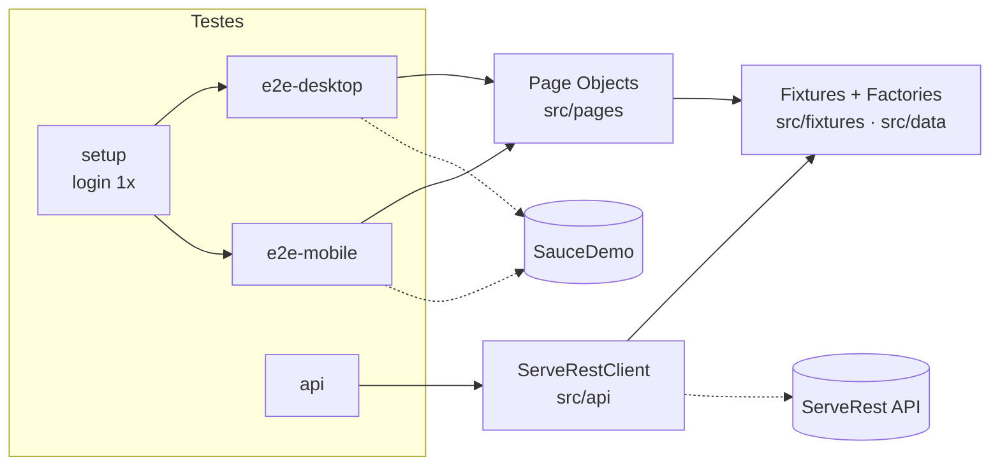

# 🎭 Playwright E2E + API

[](https://github.com/Dev-Haian/playwright-e2e-api/actions/workflows/playwright.yml)
[](https://dev-haian.github.io/playwright-e2e-api/)


Projeto de automação de testes com **Playwright + TypeScript**. Ele cobre duas camadas:

- **E2E (interface):** jornada de compra no [SauceDemo](https://www.saucedemo.com), em desktop e mobile.
- **API:** cadastro, login e autorização na [ServeRest](https://serverest.dev), uma API REST pública.

Os testes rodam sozinhos no GitHub Actions a cada push e todo dia útil às 8h. O relatório é publicado online.

> 👉 **[Ver o último relatório de execução](https://dev-haian.github.io/playwright-e2e-api/)**

---

## Em 30 segundos

| | |
| --- | --- |
| **35 testes** | 24 de interface (12 cenários × desktop e mobile), 10 de API e 1 de login inicial |
| **Page Objects** | Cada tela é uma classe; o teste descreve *o quê*, a página sabe *como* |
| **Fixtures** | Páginas, cliente de API e massa de dados injetados no teste, com limpeza automática |
| **Sessão reaproveitada** | O login acontece uma vez (`storageState`) e os testes já começam logados |
| **Massa de dados única** | Faker gera dados novos a cada execução, permitindo rodar em paralelo |
| **CI/CD** | GitHub Actions: checa tipos → roda testes → publica relatório no GitHub Pages |

---

## Como o projeto está organizado



```
playwright-e2e-api/
├── src/
│   ├── pages/        # Page Objects: LoginPage, InventoryPage, CartPage, CheckoutPage
│   ├── api/          # ServeRestClient: um método por endpoint
│   ├── data/         # factories.ts: gera usuários, produtos e compradores
│   └── fixtures/     # injeta tudo nos testes e limpa os dados no final
├── tests/
│   ├── setup/        # login único que salva a sessão
│   ├── e2e/          # login, compra, ordenação
│   └── api/          # usuários, login, produtos
├── playwright.config.ts
└── .github/workflows/playwright.yml
```

## O que é testado

**Interface (SauceDemo)**

| Funcionalidade | Cenários |
| --- | --- |
| Login | usuário válido, bloqueado, senha errada, campos obrigatórios, acesso sem login |
| Compra | jornada completa, **subtotal = soma dos itens** (regra de negócio), remover item, dados obrigatórios no checkout |
| Vitrine | ordenação por preço (crescente e decrescente) e por nome |

**API (ServeRest)**

| Endpoint | Cenários |
| --- | --- |
| `/usuarios` | cadastro + consulta, e-mail duplicado, exclusão, campos obrigatórios |
| `/login` | token válido, senha errada (401), tempo de resposta |
| `/produtos` | admin cadastra (201), sem token (401), usuário comum (403) |

## Como rodar na sua máquina

Pré-requisito: Node.js 20 ou superior.

```bash
npm ci                                  # instala as dependências
npx playwright install chromium         # instala o navegador
npm test                                # roda tudo
```

Outros comandos úteis:

```bash
npm run test:api      # só API
npm run test:e2e      # só interface
npm run test:smoke    # só os testes marcados como @smoke
npm run test:ui       # modo visual do Playwright, para depurar
npm run report        # abre o último relatório
```

## Decisões técnicas

- **Por que Playwright?** Espera automática pelos elementos (menos `sleep` e menos testes instáveis), API e interface na mesma ferramenta, e o *trace viewer* para investigar falhas.
- **Por que `data-test` como seletor?** É um atributo feito para testes. Não quebra quando o texto ou o CSS da tela mudam.
- **Por que o login fica num projeto `setup`?** Logar pela tela em cada teste é lento e repete risco. Logando uma vez, a suíte fica mais rápida e mais estável.
- **Por que limpar os dados no final?** A ServeRest é pública e compartilhada. Cada usuário criado é apagado pela fixture, mesmo se o teste falhar.
- **Retries só no CI:** localmente uma falha aparece na hora. No CI, duas novas tentativas com *trace* ajudam a separar bug real de instabilidade de rede.

## Próximos passos

- [ ] Testes de contrato da API (validação de schema)
- [ ] Testes de acessibilidade com `@axe-core/playwright`
- [ ] Testes de regressão visual

---

Feito por **Haian Vilas Boas**, QA. [LinkedIn](https://www.linkedin.com/in/haian-vilas-boas-806647221/) · [Portfólio](https://haianportifolio.framer.website/)
