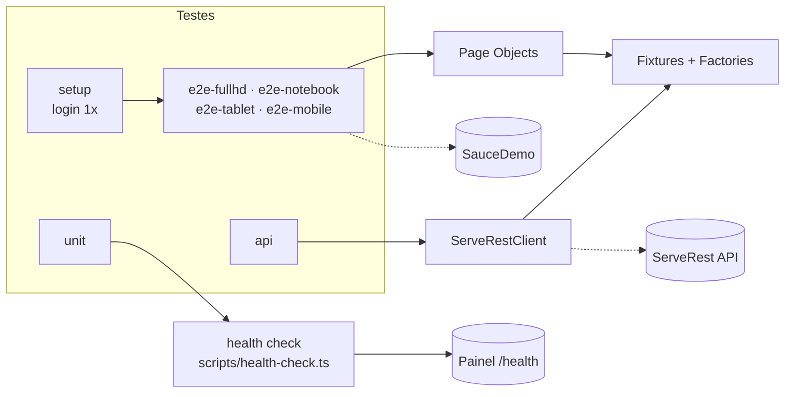

# 🎭 Playwright E2E + API

[](https://github.com/Dev-Haian/playwright-e2e-api/actions/workflows/playwright.yml)
[](https://dev-haian.github.io/playwright-e2e-api/)
[](https://dev-haian.github.io/playwright-e2e-api/health/)


Projeto de automação de testes com **Playwright + TypeScript**. Ele cobre três camadas:

- **E2E (interface):** jornada de compra no [SauceDemo](https://www.saucedemo.com), em **4 resoluções** (Full HD, notebook, tablet e celular).
- **API:** cadastro, login e autorização na [ServeRest](https://serverest.dev), uma API REST pública.
- **Health check:** monitora se os serviços estão no ar, detecta quando um cai ou volta e pode enviar alerta.

Tudo roda sozinho no GitHub Actions a cada push e todo dia útil às 8h. Os relatórios são publicados online.

> 👉 **[Relatório dos testes](https://dev-haian.github.io/playwright-e2e-api/)** · **[Painel de health check](https://dev-haian.github.io/playwright-e2e-api/health/)**

---

## Em 30 segundos

| | |
| --- | --- |
| **74 testes** | 48 de interface (12 cenários × 4 resoluções), 10 de API, 15 unitários e 1 de login inicial |
| **Matriz de resoluções** | 1920×1080, 1366×768, 768×1024 e 390×844; dá para escolher com `TEST_VIEWPORT` |
| **Health check** | Classifica cada serviço como UP ou DOWN, mede lentidão e só alerta quando algo muda |
| **Page Objects** | Cada tela é uma classe; o teste descreve *o quê*, a página sabe *como* |
| **Fixtures** | Páginas, cliente de API e massa de dados injetados no teste, com limpeza automática |
| **Sessão reaproveitada** | O login acontece uma vez (`storageState`) e os testes já começam logados |
| **CI/CD** | GitHub Actions: tipos → health check → testes → relatórios publicados no GitHub Pages |

---

## Como o projeto está organizado



```
playwright-e2e-api/
├── src/
│   ├── config/       # viewports.ts: matriz de resoluções
│   ├── pages/        # Page Objects: LoginPage, InventoryPage, CartPage, CheckoutPage
│   ├── api/          # ServeRestClient: um método por endpoint
│   ├── data/         # factories.ts: gera usuários, produtos e compradores
│   ├── fixtures/     # injeta tudo nos testes e limpa os dados no final
│   └── monitoring/   # health check: alvos, regra UP/DOWN, painel HTML e alerta
├── scripts/
│   └── health-check.ts
├── tests/
│   ├── setup/        # login único que salva a sessão
│   ├── e2e/          # login, compra, ordenação
│   ├── api/          # usuários, login, produtos
│   └── unit/         # regra do health check
├── playwright.config.ts
└── .github/workflows/playwright.yml
```

## O que é testado

**Interface (SauceDemo)**, em cada uma das 4 resoluções

| Funcionalidade | Cenários |
| --- | --- |
| Login | usuário válido, bloqueado, senha errada, campos obrigatórios, acesso sem login |
| Compra | jornada completa, **subtotal = soma dos itens** (regra de negócio), remover item, dados obrigatórios no checkout |
| Vitrine | ordenação por preço (crescente e decrescente) e por nome |

**API (ServeRest)**

| Endpoint | Cenários |
| --- | --- |
| `/usuarios` | cadastro + consulta, e-mail duplicado, exclusão, campos obrigatórios |
| `/login` | token válido, senha errada (401), tempo de resposta |
| `/produtos` | admin cadastra (201), sem token (401), usuário comum (403) |

## Health check

Antes dos testes, o pipeline verifica se cada serviço está no ar. A lista de alvos fica em `src/monitoring/targets.ts`.

| Resultado | Quando |
| --- | --- |
| 🔴 **DOWN** | HTTP 408, 500, 502, 504, timeout ou falha de rede |
| 🟢 **UP** | qualquer outra resposta (um 401 ou 404 prova que o serviço respondeu) |
| 🐢 **lento** | resposta acima de 2 segundos (`HEALTH_SLOW_MS`) |

O último estado de cada serviço fica guardado entre execuções. Assim o monitor sabe o que **acabou de cair** e o que **voltou**, e só manda alerta nessas mudanças, sem repetir a mesma notificação. O alerta é opcional: basta cadastrar o secret `HEALTH_WEBHOOK_URL` (Slack, Teams ou Discord).

A regra de classificação tem testes unitários próprios (`tests/unit`). Para simular uma queda e ver o alerta: `FORCE_DOWN=serverest-usuarios npm run health`.

## Como rodar na sua máquina

Pré-requisito: Node.js 20 ou superior.

```bash
npm ci                                  # instala as dependências
npx playwright install chromium         # instala o navegador
npm test                                # roda tudo
```

Outros comandos úteis:

```bash
npm run health        # health check dos serviços (gera health-results/index.html)
npm run test:api      # só API
npm run test:e2e      # só interface, nas 4 resoluções
npm run test:mobile   # só interface, no celular
npm run test:unit     # só testes unitários
npm run test:smoke    # só os testes marcados como @smoke
npm run test:ui       # modo visual do Playwright, para depurar
```

## Decisões técnicas

- **Por que Playwright?** Espera automática pelos elementos (menos `sleep` e menos testes instáveis), API e interface na mesma ferramenta, e o *trace viewer* para investigar falhas.
- **Por que 4 resoluções?** Muitos bugs só aparecem em telas pequenas ou com zoom. Cada resolução vira um projeto do Playwright, então dá para ver no relatório exatamente onde quebrou.
- **Por que o health check roda antes dos testes?** Se a API está fora, os testes vão falhar por um motivo que não é bug. Com o painel, dá para separar na hora "o sistema caiu" de "o teste encontrou um problema".
- **Por que alertar só nas mudanças?** Alerta repetido vira ruído e o time para de ler. Avisar quando cai e quando volta é o que importa.
- **Por que `data-test` como seletor?** É um atributo feito para testes. Não quebra quando o texto ou o CSS da tela mudam.
- **Por que limpar os dados no final?** A ServeRest é pública e compartilhada. Cada usuário criado é apagado pela fixture, mesmo se o teste falhar.

## Próximos passos

- [ ] Testes de contrato da API (validação de schema)
- [ ] Testes de acessibilidade com `@axe-core/playwright`
- [ ] Histórico do health check (disponibilidade por dia)

---

Feito por **Haian Vilas Boas**, QA. [LinkedIn](https://www.linkedin.com/in/haian-vilas-boas-806647221/) · [Portfólio](https://haianportifolio.framer.website/)
